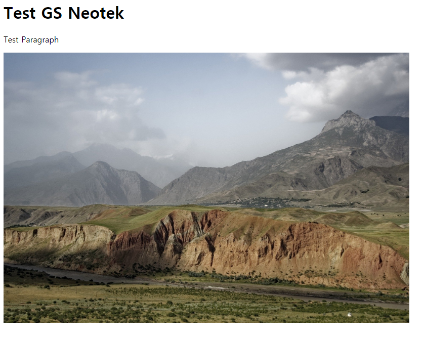

# Elastic Kubernetes Service(EKS) Sample Test


***Base Code**: https://github.com/awslabs/amazon-ecs-nodejs-microservices*


## 가정사항

* 다음 [예제](https://github.com/toule/gke-k8s-demo)와 방식은 동일함
* Amazon Web Service(AWS)에 계정이 있음
* 기본적인 쿠버네티스 API Object를 이해함
* 환경: Cloud9 (AWS IDE)
* Kubernetes version: 1.14
* Cloud9은 ec2기반으로 public에 구성하며 Security Group의 TCP 3000 port는 Any로 열어줌
* ECR에 접근하기 위해 IAM role을 설정하거나 자격증명은 미리 준비함


## Cloud9 설정

* IDE 설정 (아래 링크를 참조)

> https://github.com/toule/aws_cdk_basic_sample


## Kubectl install

- 다음 [문서](https://eksworkshop.com/020_prerequisites/k8stools/)를 참조 (엔진 버전과 클라이언트 버전이 일치하는 것을 권장함)

- Download

  ```bash
  sudo curl --silent --location -o /usr/local/bin/kubectl https://amazon-eks.s3-us-west-2.amazonaws.com/1.14.6/2019-08-22/bin/linux/amd64/kubectl
  ```

- Permission

  ```bash
  sudo chmod +x /usr/local/bin/kubectl
  ```

- Install jq, envsubset and bash-completion

  ```bash
  sudo yum -y install jq gettext bash-completion
  ```

- Enable kubectl bash_completion

  ```bash
  kubectl completion bash >>  ~/.bash_completion
  . /etc/profile.d/bash_completion.sh
  . ~/.bash_completion
  ```

- Version 확인

  ```bash
  kubectl version --short --client
  ```

  


## Kubernetes Cluster

* aws [eks cli](https://docs.aws.amazon.com/cli/latest/reference/eks/index.html)혹은 [cloudformation](https://github.com/aws-quickstart/quickstart-amazon-eks)을 활용해서 사용해도 되나 인프라 구성의 편리성을 위해 [eksctl](https://github.com/weaveworks/eksctl)을 활용 (자세한 것은 링크를 참조)

* eksctl install (참고: https://docs.aws.amazon.com/ko_kr/eks/latest/userguide/getting-started-eksctl.html)

  * aws cli upgrade

    ```bash
    pip install awscli --upgrade --user
    ```

  * curl을 사용하여 eksctl install

    ```bash
    curl --silent --location "https://github.com/weaveworks/eksctl/releases/download/latest_release/eksctl_$(uname -s)_amd64.tar.gz" | tar xz -C /tmp
    ```

  * 바이너리 파일을 /usr/local/bin으로 옮김

    ```bash
    sudo mv /tmp/eksctl /usr/local/bin
    ```

  * install 확인 (작성시 버전: 0.15.0)

    ```bash
    eksctl version
    ```

    

- 클러스터 및 작업자 노드 생성

```bash
eksctl create cluster --name eks-sample --tags Name=dev --region=ap-northeast-2 --nodegroup-name worker --node-private-networking --vpc-nat-mode Single --asg-access --alb-ingress-access --node-type t3.medium --nodes 2
```


- 클러스터 확인

```bash
eksctl get cluster
eksctl get nodegroup --cluster eks-sample
```


## 동작 확인

### 설명: 1  번 monolith directory에서 koa framework 동작

```bash
npm install
node server.js
```

- 아래와 같이 동작화면을 확인



  

## 단순 컨테이너화 확인

### 설명: 2번 container directory의 경우 1번에서 작성한 코드를 그대로 컨테이너화하여 동작

* docker가 제대로 동작하는지 확인 (3000포트가 아닌 다른 포트로 테스트하려면 SG open 필요)

```bash
docker build -t mono:test .
docker run --name="demo-container" -p 3000:3000 mono:test
```

(1번 동작화면과 동일한 화면이 보이면 됨)

* EKS에 구축하기 위해 ECR(Elastic Container Repository)에 Push

```bash
source imagepush.sh
```

* EKS 클러스터에 배포 (path: ~/manifest)
* Image tag는 ECR에 push가 된 tag name으로 변경 

```bash
kubectl create -f deploy.yaml
kubectl create -f svc.yaml
```

(정상적으로 진행이 된다면 tcp 로드밸런서에 의해 동작함)

* 생성 확인

`kubectl get pods,svc --selector=app=mono`

* Load Balancer 주소 확인

```bash
LB=$(kubectl get svc monosvc -o json | jq -r ".status.loadBalancer.ingress[].hostname")
curl -i -L $LB 
```

* (다음 진행을 위해) Object 삭제

```bash
kubectl delete -f deploy.yaml
kebectl delete -f svc.yaml
```

## 마이크로 서비스 컨테이너화 확인

### 설명: api 단위로 나누어서 배포 진행 (3번 directory로 들어가면 서비스별로 나눈 것을 확인할 수 있음)

* 이미지 생성 후 ECR에 Push

```bash
source push.sh
```

* manifest folder에서 ECR에 push된 이미지 tag name을 확인하고 deploy.yaml파일의 컨테이너 이미지 태그를 수정

- 현 예제는 하나의 ALB를 활용하여 구성할 것이며 사전 준비는 다음 문서를 [참조](https://docs.aws.amazon.com/ko_kr/eks/latest/userguide/alb-ingress.html)함
- ALB 수신 클러스터에 대한 클러스터 Role Binding 구성

```bash
kubectl apply -f https://raw.githubusercontent.com/kubernetes-sigs/aws-alb-ingress-controller/v1.1.4/docs/examples/rbac-role.yaml
```

- ALB 수신 컨트롤러 배포

```bash
kubectl apply -f https://raw.githubusercontent.com/kubernetes-sigs/aws-alb-ingress-controller/v1.1.4/docs/examples/alb-ingress-controller.yaml
```

- ALB 수신 컨트롤러를 현재 클러스터 환경으로 셋팅

```bash
kubectl edit deployment.apps/alb-ingress-controller -n kube-system
```

- 위의 설정 값에서 `--ingress-class=alb`행 뒤에 클러스터에 대한 설정을 파라미터로 설정함


* eks 클러스터에 배포

```bash
kubectl create -f deploy.yaml
kubectl create -f svc.yaml
kubectl create -f ingress.yaml 
```

* 생성 확인

```bash
kubectl get pods,deploy,svc,ingress --selector=app=msa
```

(HTTP(S) Load Balancer의 경우 생성하고 배포하는데 수분이 소요됨)


(정상적으로 진행이 된다면 HTTP 로드밸런서에 의해 동작함)

* Load Balancer 주소 확인

```bash
LB=$(kubectl get ingress ingress-l7 -o json | jq -r ".status.loadBalancer.ingress[].ip")
echo $LB
curl -i -L $LB
```


## 정리

* Object 삭제

```bash
kubectl delete -f deploy.yaml
kubectl delete -f svc.yaml
kubectl delete -f ingress.yaml
```

* 클러스터 삭제

```bash
gcloud container clusters delete sample-cluster --zone asia-northeast3-a
```

(혹은 console에서 삭제)
